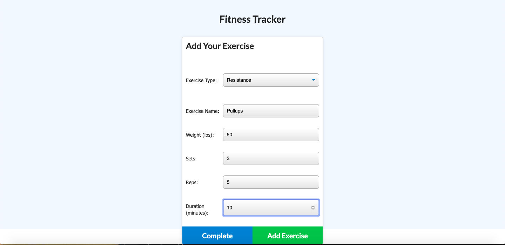
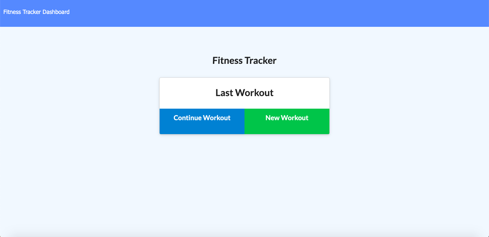
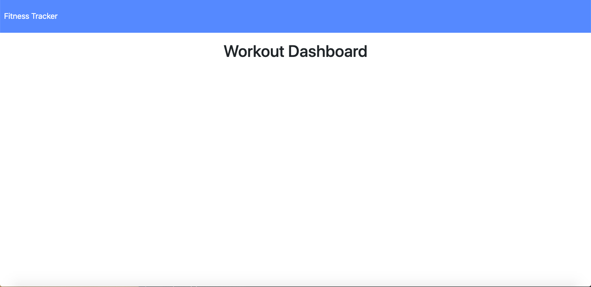

# Fitness Tracker

Use this app to create and record workout routines. Record information like the name, type, weight, sets, reps, and time spent on each exercise. Distance can be recorded for cardio exercises. 

## Installation

```bash
Install MongoDB and Robo3T
npm install express path mongoose
```

## Usage

```python
Ensure that mongod is running in a background terminal before starting your server.
```

## Images




